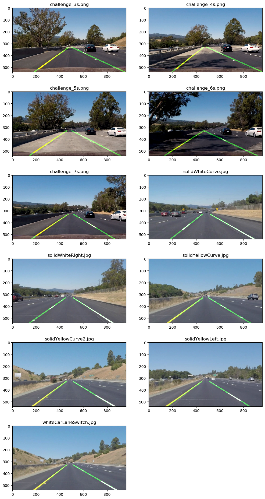

# **Finding Lane Lines on the Road**

## Overview

When we drive, we use our eyes to decide where to go. The lines on the road that show us where the lanes are act as our constant reference for where to steer the vehicle. Naturally, one of the first things we would like to do in developing a self-driving car is to automatically detect lane lines using an algorithm.

In this project you will detect lane lines in images using Python and OpenCV. OpenCV means "Open-Source Computer Vision", which is a package that has many useful tools for analyzing images.

This is the first asigment of the [Self-Driving Car Engineer Nanodegree Program](https://www.udacity.com/course/self-driving-car-engineer-nanodegree) from Udacity

# Pipeline

---

- Import and standarize images
- Enhance colors with hsl color palette
- Convert to Gray scale
- Gaussian smoothing
- Canny edge detector
- Region of interest segmentation
- Hough transform
- Draw straight lines
  - Categorize lines by slope and x position
  - Apply unidimensional fitting
  - Obtain extreme points from the fitting equation
  - Extrapolate to fill image
- Overlap lines with original image
- For videos:
  - Apply a runnign average filter for frames
  - filtero out sudden changes in lines between frames

---

For an explanation of each technique see the Jupyter Notebook file of the project.

## Results on images

---

## Results on videos

---

## Shortcomings

- Awfull implementation of the pipeline on videos with frame averaging.
- Fine Tunnig, speed...

## Improvements:

- ~~Improve image processing specially of shadows~~
- ~~Left line tends to tighten~~
- ~~Left line moves more than right~~
- ~~Lines have differnt height~~
- ~~Unify resolutions~~
- ~~Draw lines individually if availiable~~
- ~~HSL pre filtering~~
  - ~~Yellow color isolation~~
  - ~~White color isolation~~
- ~~Increase Smoothing in videos by taking into account previous frames~~
  - ~~Smooth out behaviour dotted lines~~
- Apply statistics in hough function to detect odd straights
- Improve impelmentation of video frame smoothing
  - Try objects and classes?
- Why sometimes the polyfit does not fidn a straight even there are suitable hough lines

**Tools available**

- HSL mask filtering
- Region of interest selection
- Grayscaling
- Gaussian smoothing
- Canny Edge Detection
- Hough Tranform line detection
- Frame smoothing
